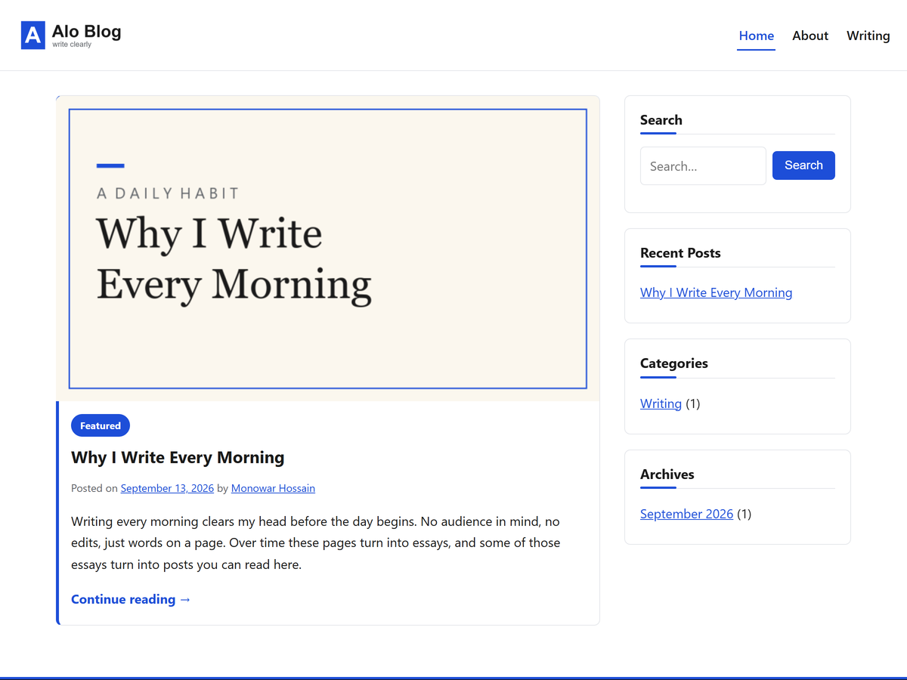

# Alo Blog

A lightweight personal blog theme for writers. Fast, readable, keyboard and screen-reader friendly.

## Install

* From WordPress.org: https://wordpress.org/themes/alo-blog/ (Appearance → Themes → Add New, search “Alo Blog”)
* From source: download this repo as ZIP, upload via Appearance → Themes → Add New → Upload.
* Try it now (no install): https://playground.wordpress.net/?theme=alo-blog — live demo in your browser.

Requires WordPress 6.4+ and PHP 7.4+.

## Features

* Accessibility-first: skip link, visible focus, keyboard-operable menus with focus trap, screen-reader labels.
* Reader-first typography: 720px measure, system-font stack, generous line-height.
* Writer-friendly details: sticky Featured posts, author box, tag pills, reading progress bar, continue-reading links that name the post.
* Block-ready: matching editor styles, accent quote style, three starter patterns.
* Translation-ready with RTL stylesheet, threaded comments, right sidebar + footer widgets.
* Privacy-respecting: zero external requests, zero tracking, no page builder, no slider, no upsells.

## Support

* WordPress.org forum: https://wordpress.org/support/theme/alo-blog/
* Bug reports: https://github.com/devmonowar/alo-blog/issues (please include your WordPress version and steps to reproduce)

## Author

Monowar Hossain — https://devmonowar.github.io/

## License

GPLv2 or later. See `readme.txt` for full copyright and resource credits.
